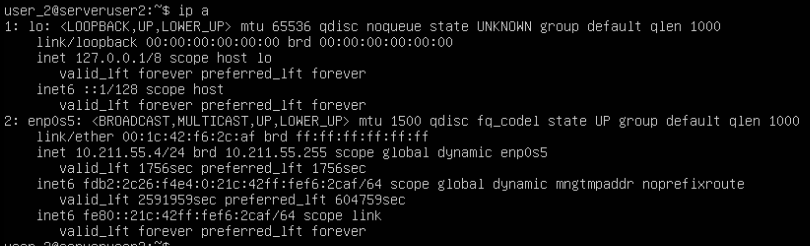

## Part 1. Инструмент ipcalc

- Подняли виртуальную машину Ubuntu 20.04 LTS.

### 1.1. Сети и маски

- адрес сети 192.167.38.54/13 - **192.167.38**;

- перевод маски 255.255.255.0 в префиксную - /24, в двоичную запись - 11111111.11111111.11111111.00000000; 

/15 в обычную - 255.254.0.0, в двоичную - 11111111.11111110.00000000.00000000; 

11111111.11111111.11111111.11110000 в обычную - 255.255.255.240, в префиксную - /28;

- минимальный и максимальный хост в сети 12.167.38.4 при масках: /8 - min 12.0.0.1, max 12.255.255.254;

11111111.11111111.00000000.00000000 - min 12.167.0.1, max 12.167.255.254;

255.255.254.0 - min 12.167.38.1, max 12.167.39.254;

/4 - min 0.0.0.1, max 15.255.255.254.

### 1.2. localhost

- Определить и записать в отчёт, можно ли обратиться к приложению, работающему на localhost, со следующими IP: 194.34.23.100 - нет, 127.0.0.2 - да, 127.1.0.1 - да, 128.0.0.1 - нет.

### 1.3. Диапазоны и сегменты сетей

- какие из перечисленных IP можно использовать в качестве публичного, а какие только в качестве частных: 10.0.0.45 - частный, 134.43.0.2 - публичный, 192.168.4.2 - частный, 172.20.250.4 - частный, 172.0.2.1 - публичный, 192.172.0.1 - публичный, 172.68.0.2 - публичный, 172.16.255.255 - частный, 10.10.10.10 - частный, 192.169.168.1 - публичный;

- какие из перечисленных IP адресов шлюза возможны у сети 10.10.0.0/18: 10.0.0.1 - нет, 10.10.0.2 - да, 10.10.10.10 - да, 10.10.100.1 - нет, 10.10.1.255 - да.

## Part 2. Статическая маршрутизация между двумя машинами

- С помощью команды `ip a` посмотреть существующие сетевые интерфейсы

- Сетевые интерфейсы данной системы: enp0s5, lo (loopback device) – виртуальный интерфейс, присутствующий по умолчанию в любом Linux. Он используется для отладки сетевых программ и запуска серверных приложений на локальной машине. С этим интерфейсом всегда связан адрес 127.0.0.1.

- На обеих машинах и задать следующие адреса и маски: ws1 - 192.168.100.10, маска /16, ws2 - 172.24.116.8, маска /12. 

Необходимо определить файл конфигурации с помощью команды `ls /etc/netplan/`, таковым в нашем случае является `00-installer-config.yaml`.
Далее необходимо перейти к редактированию этого файла с помощью vim - `sudo vim /etc/netplan/00-installer-config.yaml`.

Ниже представлены скрины с содержанием изменённого файла `etc/netplan/00-installer-config.yaml` для каждой машины.

- Ниже представлен вызов команды `sudo netplan apply`.

### 2.1. Добавление статического маршрута вручную

- Добавить статический маршрут от одной машины до другой и обратно при помощи команды вида `ip r add`.

- Пропингованное соединение между машинами представлено на скринах.

### 2.2. Добавление статического маршрута с сохранением

- Перезапустить машины.

- Добавить статический маршрут от одной машины до другой с помощью файла `/etc/netplan/00-installer-config.yaml`. На скриншотах представлены измененные файлы.
 Для выполнения данной части в файле были прописаны дополнительные строки: `routes:  -to: адрес машины via: адрес другой машины`
 

- Пропингованное соединение между машинами представлено на скринах.

## Part 3. Утилита iperf3

### 3.1. Скорость соединения

- 8 Mbps - 1 MB/s, 

- 100 MB/s - 800000 Kbps, 

- 1 Gbps - 1000 Mbps.

### 3.2. Утилита iperf3

- Измерить скорость соединения между ws1 и ws2. Данную задачу можно выполнить с помощью команды `iperf3 -c 172.24.116.8`, выполненной на ws1. На ws2 в этот момент запущена команда `iperf3 -s`.

## Part 4. Сетевой экран

### 4.1. Утилита iptables

- Необходимо создать файл `/etc/firewall.sh`, имитирующий фаерволл, на ws1 и ws2.

- Необходимо заполнить их согласно инструкции:

- На ws1 применить стратегию когда в начале пишется запрещающее правило, а в конце пишется разрешающее правило (это касается пунктов 4 и 5);

- На ws2 применить стратегию когда в начале пишется разрешающее правило, а в конце пишется запрещающее правило (это касается пунктов 4 и 5);

- Открыть на машинах доступ для порта 22 (ssh) и порта 80 (http);

- Запретить echo reply (машина не должна "пинговаться”, т.е. должна быть блокировка на OUTPUT);

- Разрешить echo reply (машина должна "пинговаться").

- На скриншотах ниже представлено содержание файлов, заполненное согласно правилам.

- Скриншоты с запуском команд `sudo chmod +x /etc/firewall.sh` и `sudo /etc/firewall.sh`

- Разница между правилами заключается в том, что в машине ws1 первым правилом является запрещающее. При срабатывании условия применяется правило REJECT и сбрасывает пакет данных, из-за чего соединение не устанавливается.

- В машине ws2 первым установлено разрешающее правило, которое позволяет отвечать пакетом Echo Reply, тем самым соединение устанавливается.

### 4.2. Утилита nmap

- Командой ping найти машину, которая не "пингуется", после чего утилитой nmap с флагом -sV (исследовать открытые порты для определения информации о службе/версии) показать, что хост машины запущен.

## Part 5. Статическая маршрутизация сети

- Поднять пять виртуальных машин (3 рабочие станции (ws11, ws21, ws22) и 2 роутера (r1, r2))

### 5.1. Настройка адресов машин

- Настроить конфигурации машин в `etc/netplan/00-installer-config.yaml` согласно сети на рисунке.

- Ниже представлены скриншоты с содержанием файла `/etc/netplan/00-installer-config.yaml`.

- Файл конфигурации `r1`:

- Файл конфигурации `ws11`:

- Файл конфигурации `r2`:

- Файл конфигурации `ws21`:

- Файл конфигурации `ws22`:

- На дальнейших слайдах предстален запуск команды `ip -4 a` и пингование r1 с ws11 и ws22 c ws21.

- И r2, ws21, ws22.

### 5.2. Включение переадресации IP-адресов.

- Скриншоты с вызовом и выводом использованной команды `sysctl -w net.ipv4.ip_forward=1` на роутерах r1 и r2.

 

- Скриншот откройтия файла `/etc/sysctl.conf` и добавлене в него следующую строки:
`net.ipv4.ip_forward = 1`. При использовании этого подхода, IP-переадресация включена на постоянной основе.

 

### 5.3. Установка маршрута по-умолчанию

- Настройка маршрута по-умолчанию (шлюз) для рабочих станций. Для этого добавить default перед IP роутера в файле конфигураций.

- Ниже представлены скриншоты с содержанием файла `etc/netplan/00-installer-config.yaml` для виртуальных машин.

- Скриншоты вызова функции `ip -4 a`, для подтверждения добавления маршрута в таблицу маршрутизации.

- Скриншоты с пингованием роутера r2 c ws11 и показание на r2, что пинг доходит. Для этого использована команда `tcpdump -tn -i eth1`.

### 5.4. Добавление статических маршрутов

- Добавить в роутеры r1 и r2 статические маршруты в файле конфигураций. Скриншоты представлены ниже.

- Вызвать ip r и показать таблицы с маршрутами на обоих роутерах. 

- Запустить команды `ip r list 10.10.0.0/[маска сети]` и `ip r list 0.0.0.0/0` на ws11.

- 0.0.0.0/0 - это маршрут по умолчанию в Интернет-протоколе версии 4 (IPv4) или нулевой адрес. Маска подсети (/0) фактически указывает все сети и является кратчайшим возможным совпадением. Поиск маршрута, который не соответствует ни одному другому правилу, возвращается к этому маршруту.

### 5.5. Построение списка маршрутизаторов

- Запустить на r1 команду `tcpdump -tnv -i eth0`.

- При помощи утилиты `traceroute` построить список маршрутизаторов на пути от ws11 до ws21.

- Результаты представлены на скриншотах ниже

- Команда traceroute использует UDP пакеты, она отправляет пакет с TTL(Time To Live продолжительность хранения записи DNS в кэше)=1 и смотрит адрес ответившего узла, дальше TTL=2, TTL=3 и так пока не достигнет цели. Каждый раз отправляется по три пакета и для каждого из них измеряется время прохождения. Пакет отправляется на случайный порт, который, скорее всего, не занят. Когда утилита traceroute получает сообщение от целевого узла о том, что порт недоступен трассировка считается завершенной.

### 5.6. Использование протокола ICMP при маршрутизации

- Запустить на r1 перехват сетевого трафика, проходящего через eth0 с помощью команды `tcpdump -n -i eth0 icmp`.

Пропинговать с ws11 несуществующий IP (например, 10.30.0.111) с помощью команды `ping -c 1 10.30.0.111`.

- Результаты представлены на скриншотах.

## Part 6. Динамическая настройка IP с помощью DHCP

- Для r2 настроить в файле `/etc/dhcp/dhcpd.conf` конфигурацию службы DHCP:

- указать адрес маршрутизатора по-умолчанию, DNS-сервер и адрес внутренней сети.

- в файле `/etc/resolv.conf` прописать nameserver 8.8.8.8. 

- Результаты представлены на скриншоте ниже.

- Перезагрузить службу DHCP командой `systemctl restart isc-dhcp-server`. Машину ws21 перезагрузить при помощи reboot и через ip a показать, что она получила адрес. Также пропинговать ws22 с ws21. Скриншоты с вызовом и выводом функции представлены ниже.

- Указать MAC адрес у ws11, для этого в `etc/netplan/00-installer-config.yaml` надо добавить строки: `macaddress: 10:10:10:10:10:BA, dhcp4: true`. Скриншоты с изменным файлом.

- Для r1 настроить аналогично r2, но сделать выдачу адресов с жесткой привязкой к MAC-адресу (ws11). Провести аналогичные тесты. 

- Изменены файлы `/etc/dhcp/dhcpd.conf` и `/etc/resolv.conf` аналогично p2.

- На r1 перезагружена служба DHCP командой `systemctl restart isc-dhcp-server`, ws11 командой `reboot`, получены IP адреса (ip a), пропингованы r1 с ws11.

- Запросить с ws21 обновление ip адреса. На скриншотах представлен запрос до обновления, процесс обновления.

- Используя DHCP нам не нужно производить настройку сети на каждом отдельном устройстве, нужно лишь подключить устройство к сети и DHCP сервер сделает все настройки автоматически, опции DHCP сервера:

- `host ws11` — фиксированный (статический) IP-адрес;

- `hardware ethernet 10:10:10:10:10:ba` — MAC-адрес;

- `fixed-address 10.10.0.2` — статически выделяемый IP-адрес;

- `subnet 10.10.0.0 netmask 255.255.0.0` — сеть ip и её маска;

- `option routers` — адрес роутера;

- `option domain-name-servers` — адрес DNS сервера, который расположен на этом же компьютере и слушает интерфейс с адресом 10.10.0.1;

- `default-lease-time 600` — время аренды(в секундах) адреса у сервера, если клиент не запросил другое;

- `max-lease-time 7200` — максимальное время аренды в секундах;

- `range 10.10.0.10 10.10.0.20` — диапазон IP-адресов, выделяемый клиентам (бязательно указать хотя бы один, можно указывать несколько диапазонов).

## Part 7. NAT

- В файле `/etc/apache2/ports.conf` на ws22 и r1 изменить строку `Listen 80` на `Listen 0.0.0.0:80`, то есть сделать сервер Apache2 общедоступным. Ниже представлены скриншоты с изменными файлами.

- Запустить веб-сервер Apache командой `service apache2 start` на ws22 и r1. Вызов и вывод функции представлен на скриншотах ниже.

- Добавить в фаервол, созданный по аналогии с фаерволом из Части 4, на r2 следующие правила:

- удаление правил в таблице filter - `iptables -F`;

- удаление правил в таблице "NAT" - `iptables -F -t nat`;

- отбрасывать все маршрутизируемые пакеты - `iptables --policy FORWARD DROP`.

- Скриншот с измененным файлом представлен ниже.

- Проверить соединение между ws22 и r1 командой `ping`. Результаты представлены ниже. Как и следует из условия, машины не пингуются между собой.

- Добавить в файл ещё одно правило:

- разрешить маршрутизацию всех пакетов протокола ICMP. Скриншоты с результатами представлены ниже. Машины, как необходимо, пингуются.

- Добавить в файл ещё два правила:

- включить SNAT, а именно маскирование всех локальных ip из локальной сети, находящейся за r2 (по обозначениям из Части 5 - `сеть 10.20.0.0`);

- включить DNAT на 8080 порт машины r2 и добавить к веб-серверу Apache, запущенному на ws22, доступ извне сети. Скриншоты с результатами представлены ниже.

- Проверить соединение по TCP для SNAT, для этого с ws22 подключиться к серверу Apache на r1 командой:
`telnet [адрес] [порт]`. Скриншоты результатов ниже.

- Проверить соединение по TCP для DNAT, для этого с r1 подключиться к серверу Apache на ws22 командой `telnet` (обращаться по адресу r2 и порту 8080). Ниже представлены результаты.

## Part 8. Дополнительно. Знакомство с SSH Tunnels

- Запустить на r2 фаервол с правилами из Части 7.

- Запустить веб-сервер Apache на ws22 только на localhost (то есть в файле `/etc/apache2/ports.conf` изменить строку `Listen 80` на `Listen localhost:80`).

- Воспользоваться `Local TCP forwarding` с ws21 до ws22, чтобы получить доступ к веб-серверу на ws22 с ws21.

- Воспользоваться `Remote TCP forwarding` c ws11 до ws22, чтобы получить доступ к веб-серверу на ws22 с ws11.

- Для проверки, сработало ли подключение в обоих предыдущих пунктах, перейдите во второй терминал (например, клавишами Alt + F2) и выполните команду: `telnet 127.0.0.1 [локальный порт]`.

