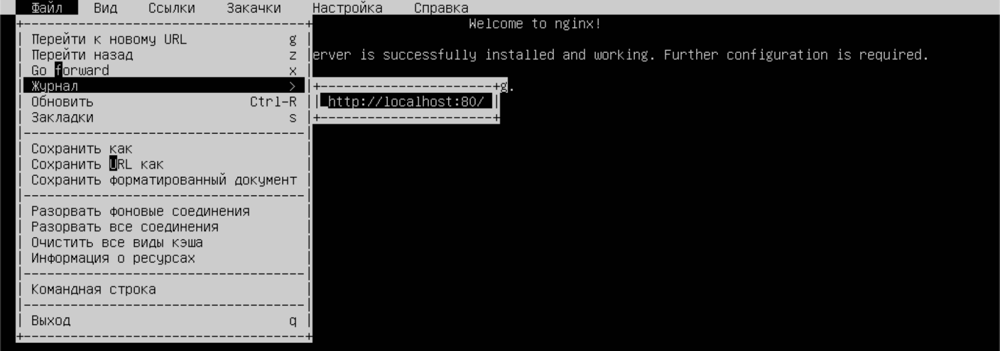
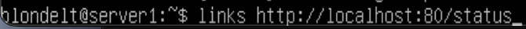

## Part 1. Готовый докер

- Взятие официального докер образа с nginx и выкачивание при помощи `docker pull`

- Проверка наличия докер образа через `docker images`

- Запуск докер образа через `docker run -d 5628e5ea3c17`

- Проверка, что образ запустился через `docker ps`

- Посмотреть информацию о контейнере через `docker inspect dazzling_elgamal`

Вызов команды

Вывод команды 

Размер контейнера

Cписок замапленных портов

IP контейнера 

- Остановить докер образ через `docker stop relaxed_payne` и проверить, что образ остановился через `docker ps`

- Запустить докер с портами 80 и 443 в контейнере, замапленными на такие же порты на локальной машине, через команду `run`

- Проверить, что в браузере по адресу `localhost:80` доступна стартовая страница nginx. В данном случае была установлен веб-браузер `Links` с помощю команды `sudo apt install links`. При запуске программы был указан адрес `http://localhost:80`. Вывод представлен ниже

- Перезапустить докер контейнер через `docker restart `

- Проверить любым способом, что контейнер запустился

## Part 2. Операции с контейнером

- Прочитать конфигурационный файл `nginx.conf` внутри докер контейнера через команду `exec -it`

- Создать на локальной машине файл `nginx.conf`

- Настроить в нем по пути `/status` отдачу страницы статуса сервера `nginx`

- Скопировать созданный файл `nginx.conf` внутрь докер образа через команду `docker cp`

- Перезапустить `nginx` внутри докер образа через команду `exec`

- Проверить, что по адресу `localhost:80/status` отдается страничка со статусом сервера `nginx`

- Экспортировать контейнер в файл `container.tar` через команду `export`

- Остановить контейнер

- Удалить образ через `docker rmi [image_id|repository]`, не удаляя перед этим контейнеры

- Удалить остановленный контейнер

- Импортировать контейнер обратно через команду `import`

- Запустить импортированный контейнер

- Проверить, что по адресу `localhost:80/status` отдается страничка со статусом сервера `nginx`

